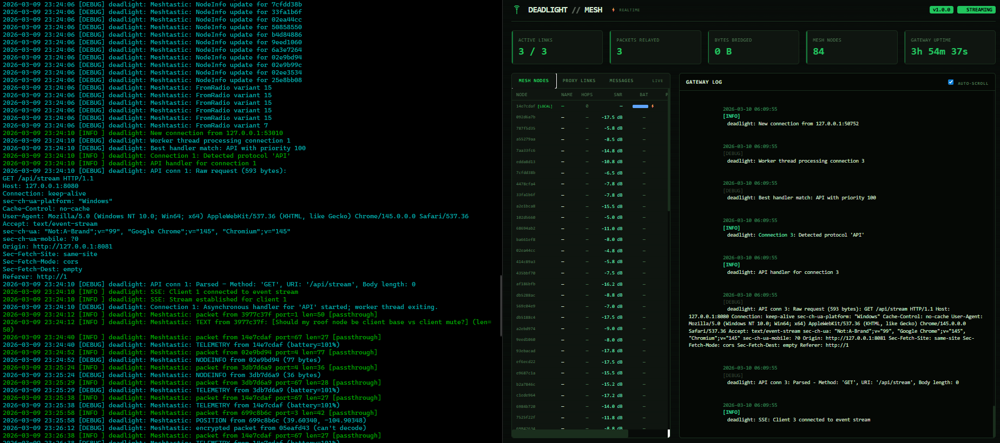
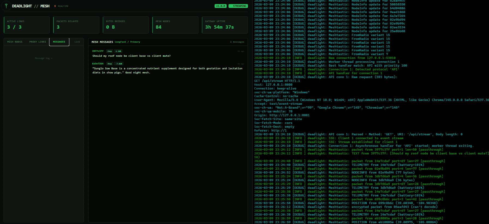

# deadmesh

**A resilient text-first Internet bridge for mesh radios: Update your blog from a can on a string from the smoldering rubble.**

Part of the [Deadlight ecosystem](https://github.com/gnarzilla#deadlight-ecosystem) secure, performant, privacy-focused tools for resilient connectivity on low-bandwidth, high-latency, and intermittently connected networks.

 · [Project Blog](https://deadmesh.boo) · [Why This Exists](#why-this-exists) · [Getting Started](#getting-started) · [Hardware](#hardware) · [Dashboard](#dashboard) · [Usage](#usage) · [Configuration](#configuration) · [How It Works](#how-it-works) · [Real-World Use Cases](#real-world-use-cases) · [Performance](#performance) · [Roadmap](#roadmap) · [License](#license)


## Overview

**deadmesh** transforms LoRa mesh networks into practical Internet gateways. Built on the [proxy.deadlight](https://github.com/gnarzilla/proxy.deadlight) foundation, it adds transparent mesh networking that lets any device on a Meshtastic mesh access standard Internet protocols: HTTP/HTTPS, email, DNS, FTP — as if they had normal connectivity.

**What makes this different from other mesh solutions:**
- Standard protocols work unchanged: browse websites, send email, use apps
- Transparent fragmentation & reassembly over Meshtastic LoRa packets, with per-chunk unique packet IDs to defeat firmware-level deduplication on multi-chunk sessions
- Full MITM proxy with caching, compression, ad-blocking, rate-limiting
- Works with off-the-shelf Meshtastic hardware
- Truly off-grid: solar-powered nodes can relay traffic across kilometers
- Real-time embedded dashboard with live mesh visibility (nodes, SNR, positions, telemetry, chat)
- Connection pooling + TLS session reuse to minimize airtime

Think of it as giving your Meshtastic network the capabilities of a satellite terminal, running on $30 hardware with zero monthly fees.

## The Bigger Picture

deadmesh is a proxy. But with caching fully built out, it becomes something more interesting: a **content-addressed network that happens to speak HTTP**.

Once a gateway has seen a piece of content, it costs zero airtime to serve it again, to anyone on the mesh, forever. Wikipedia's entire English text corpus is about 4GB as clean text. That fits on a Raspberry Pi SD card. A fully seeded gateway *is* Wikipedia, not a proxy to it; locally, instantly, with no uplink required. At that point the constraint shifts from bandwidth to curation, which is a much more human-solvable problem. That's what the [mesh librarian](#the-knowledge-appliance--mesh-librarians) model is really about.

This makes deadmesh an exit ramp from the carrier model, not just a resilience tool. Disaster response and rural connectivity are real use cases, but so is the everyday one: **a $50 hardware investment that routes around the need for a cellular data plan**, for anything that isn't a live video call.

> Voice is genuinely impossible at LoRa bitrates — even heavily compressed audio needs ~700 bps minimum, and LoRa LONG_FAST leaves ~3 kbps usable after overhead. But text, email, weather, maps, and cached web content? That's most of what a phone actually does.

## Why This Exists

Meshtastic networks are incredible for messaging and telemetry, but they weren't designed for general Internet access. Each protocol would need custom mesh-aware implementations: a chicken-and-egg problem where applications won't add mesh support without users, and users won't adopt mesh without applications.

deadmesh sits in the middle:
1. **Mesh side**: Speaks fluent Meshtastic (protobuf over LoRa serial with proper API handshake)
2. **Internet side**: Speaks every protocol your applications already use
3. **Bridges transparently**: Fragments outgoing requests, reassembles incoming responses

**Result**: Your mesh network works with everything: email clients, web browsers, update tools, API services. Without modifying a single line of application code.

The key architectural insight is treating LoRa as a **dumb byte pipe** and putting all the intelligence in the proxy layer above it. This is the same move that made TCP/IP win over every purpose-built network protocol in the 1980s. Everything that speaks HTTP already works, forever, without modification. Every protocol deadmesh adds benefits every application simultaneously.


### Critical Scenarios This Enables

- **Disaster Response**: Coordinate rescue operations when cell towers are down
- **Rural Connectivity**: Share one satellite uplink across dozens of kilometers
- **Censorship Resistance**: Maintain communication during Internet blackouts
- **Off-Grid Networks**: Festival/protest/research networks that disappear when powered off
- **Development Projects**: Bring Internet services to areas with zero infrastructure
- **Carrier Independence**: Route around cellular data plans for text-first use cases

## Features

- **Universal Protocol Support**: HTTP/HTTPS, SMTP/IMAP, SOCKS4/5, WebSocket, FTP. If it runs over TCP/IP, it works
- **Transparent TLS Interception**: Inspect and cache HTTPS traffic with HTTP/1.1 ALPN negotiation to minimize mesh bandwidth
- **Intelligent Fragmentation**: Automatically chunks large requests/responses into ~220-byte Meshtastic packets with unique per-chunk packet IDs — bypasses Meshtastic firmware's (from, id) deduplication that would silently drop all but the first chunk of multi-packet sessions
- **Serial API Handshake**: Proper `want_config` initialization, auto-discovers node ID, receives full mesh state on startup
- **Robust Serial Framing**: 0x94/0xC3 length-prefix state machine with sync recovery. If magic bytes are lost mid-stream, re-synchronizes automatically. This is what makes multi-hour uptime boring in the right way
- **Live Mesh Visibility**: Decodes all Meshtastic packet types (text messages, positions, telemetry, node info, routing)
- **Store-and-Forward**: Delay-tolerant networking handles intermittent mesh connectivity
- **Connection Pooling**: Reuses upstream connections aggressively with TLS session reuse to reduce LoRa airtime cost
- **Plugin Extensibility**: Ad blocking, rate limiting, compression, caching, custom protocol handlers
- **Hardware Flexibility**: USB serial, Bluetooth, or TCP-connected radios. Works on Raspberry Pi, x86 Linux, and WSL2 with USB/IP passthrough
- **Auto-Detection**: Auto-discovers Meshtastic devices on serial ports and auto-detects local node ID from device
- **Embedded Dashboard**: Real-time gateway monitor with SSE streaming, self-contained in the binary, no external assets
- **Live Node Table**: Persistent mesh node database; names, hops, SNR, battery, position, last heard, updated from every packet type


## Smart Mesh Routing – `mesh://` mode (Not yet implemented)

The feature that makes deadmesh actually *pleasant* to use on LoRa — and the first step toward the content-addressed mesh network described above.

- Type `mesh://en.wikipedia.org` instead of `http://` to get a clean, ultra-compressed, text-only version (~98% smaller)
- Clear, helpful denial messages when something is impossible (e.g. "YouTube would take 47 hours and 312% of your daily duty cycle" + instant alternatives)
- Shared cache that gets smarter every day. The whole mesh becomes a living knowledge appliance
- Volunteers can "seed" gateways with USB sticks (the dead librarian society)

### The Knowledge Appliance & Mesh Librarians

A warm deadmesh cache isn't just faster, it's qualitatively different. Content served from cache costs **zero airtime**. Zero duty cycle. Zero waiting.

This compounds over time:
- **First week**: mostly empty, proxying everything live
- **Month 3**: popular articles, weather endpoints, medical guides, maps already cached locally
- **Year 1**: the mesh becomes dramatically more useful every single day, without any additional infrastructure

Volunteers can accelerate this by loading curated content onto a USB stick and physically walking it to gateways, seeding them with Wikipedia, repair manuals, local maps, survival guides. The network gets smarter every time someone goes for a walk. These are the **mesh librarians**, and it's possibly the most wholesome job in off-grid networking.

At full build-out, a well-seeded gateway holds more reference material than most public libraries, serves it instantly to anyone within LoRa range, and costs nothing to operate beyond solar power and a $30 radio.

Full details and philosophy → [SMART_MESH_ROUTING.md](docs/SMART_MESH_ROUTING.md)

*(deadmesh should feel like the network is on your side.)*


## Getting Started

### Prerequisites

**Software**:
- Linux (Raspberry Pi, x86 server, or similar) — or WSL2 on Windows with USB/IP passthrough (see [WSL](#wsl-windows-subsystem-for-linux))
- GLib 2.0+, OpenSSL 1.1+, json-glib-1.0
- GCC or Clang
- Python 3 + pip (for nanopb protobuf generation during build)

**Optional** (for Meshtastic CLI testing):
- Python meshtastic package (`pip install meshtastic`)

**Hardware** (see [Hardware](#hardware) for details):
- Meshtastic-compatible LoRa radio (ESP32-based or nRF52840 recommended)
- Gateway node: Raspberry Pi, x86 Linux box, or Windows PC running WSL2
- Client nodes: any Meshtastic device (phone, handheld, custom)

### Quick Install

1. **Install system dependencies**:
   ```bash
   # Debian/Ubuntu/Raspberry Pi OS
   sudo apt-get install build-essential pkg-config libglib2.0-dev \
     libssl-dev libjson-glib-dev libmicrohttpd-dev protobuf-compiler xxd
   ```

   Verify they're all found:
   ```bash
   pkg-config --modversion glib-2.0 openssl json-glib-1.0
   # Should print three version numbers — if any fail, the build will fail
   ```

2. **Set up Python environment for protobuf generation**:

   The nanopb generator that compiles Meshtastic protobufs requires specific Python packages. Use a venv to avoid conflicts with system Python:
   ```bash
   python3 -m venv venv
   source venv/bin/activate
   pip install protobuf grpcio-tools
   ```
   > **Keep this venv active for the build step.** You can deactivate it after `make` completes.

3. **Clone and build**:
   ```bash
   git clone https://github.com/gnarzilla/deadmesh.git
   cd deadmesh
   make clean && make UI=1
   deactivate  # exit venv after build
   ```

   A successful build produces:
   ```
   bin/deadmesh
   bin/plugins/adblocker.so
   bin/plugins/meshtastic.so
   bin/plugins/ratelimiter.so
   tools/mesh-sim
   ```

4. **Connect your Meshtastic radio**:
   ```bash
   # Most devices appear as /dev/ttyACM0 or /dev/ttyUSB0
   ls -l /dev/ttyACM0 /dev/ttyUSB0 2>/dev/null

   # Add yourself to the dialout group
   sudo usermod -a -G dialout $USER
   # Log out and back in for group change to take effect
   ```

5. **Generate CA certificate** (for HTTPS interception):

   Create the cert directory first, then generate a local CA:
   ```bash
   mkdir -p ~/.deadlight

   openssl genrsa -out ~/.deadlight/ca.key 4096
   openssl req -new -x509 -days 3650 \
     -key ~/.deadlight/ca.key \
     -out ~/.deadlight/ca.crt \
     -subj "/CN=deadmesh CA/O=deadlight/C=US"

   chmod 600 ~/.deadlight/ca.key
   chmod 644 ~/.deadlight/ca.crt
   ```

   Install it system-wide so curl and other tools trust it:
   ```bash
   sudo cp ~/.deadlight/ca.crt /usr/local/share/ca-certificates/deadmesh.crt
   sudo update-ca-certificates
   ```

   > **Copying from another machine?** If you already have a CA from a previous install (e.g. WSL), copy both `ca.crt` and `ca.key` to `~/.deadlight/` on the new machine instead of generating new ones.

6. **Configure** — create `deadmesh.conf`:
   ```ini
   [core]
   port = 8080
   max_connections = 50
   log_level = info

   [meshtastic]
   enabled = true
   serial_port = /dev/ttyACM0
   baud_rate = 115200
   mesh_node_id = 0          ; 0 = auto-detect from device
   fragment_size = 220
   ack_timeout = 30000
   max_retries = 3
   hop_limit = 3

   [ssl]
   enabled = true
   ca_cert_file = /home/youruser/.deadlight/ca.crt
   ca_key_file = /home/youruser/.deadlight/ca.key

   [network]
   connection_pool_size = 5
   connection_pool_timeout = 600
   upstream_timeout = 120
   ```

   > **Important**: Use absolute paths for `ca_cert_file` and `ca_key_file` — replace `youruser` with your actual username. The `~` shortcut expands to `/root/` when running with `sudo`, which is not where your certs are.

7. **Run the gateway**:
   ```bash
   ./bin/deadmesh -c deadmesh.conf -v
   ```

   You should see:
   - `Configuration loaded` and `Config applied` — config is valid
   - `Meshtastic: sent want_config handshake` — serial API initialized
   - `Meshtastic: auto-detected local node ID: XXXXXXXX` — device recognized
   - `Meshtastic: NodeInfo update for XXXXXXXX` — mesh nodes populating
   - Live packet stream: `POSITION`, `TELEMETRY`, `TEXT`, `NODEINFO` from mesh

   If you see `Configuration validation failed: Cannot read CA cert file` — the path in your config doesn't match where you put the certs. Double-check the absolute path and that `~/.deadlight/ca.crt` exists.

8. **Open the dashboard** at `http://localhost:8081` to monitor gateway activity.

9. **Test the proxy**:
   ```bash
   # HTTP
   curl -x http://localhost:8080 http://example.com

   # HTTPS
   curl --cacert ~/.deadlight/ca.crt -x http://localhost:8080 https://example.com

   # SOCKS5
   curl --socks5 localhost:8080 http://example.com
   ```

### Client-side Proxy (send device/second radio)

The `deadmesh-client` binary runs a tiny local HTTP proxy that tunnels traffic over the mesh to your gateway.

> Build note: Serial mode requires a compile-time flag

```bash
# Add -DCLIENT_TRANSPORT_SERIAL to client target in Makefile (see earlier instructions)
make clean client UI=1
```

Run on client device (replace with your gateway's node ID):
```bash
./bin/deadmesh-client --gateway 14e7cdaf --device /dev/ttyACM0 -v
# or Bluetooth serial
./bin/deadmesh-client --gateway 14e7cdaf --device /dev/rfcomm0 -v
```

Once running (listens on localhost:8888):
```bash
export http_proxy=http://localhost:8888
curl http://example.com
```

### WSL (Windows Subsystem for Linux)

deadmesh works under WSL2 with USB/IP passthrough for the Meshtastic radio. This is a fully supported configuration — the reference gateway setup during development runs this way.

```powershell
# PowerShell (Admin) — install and attach USB device
winget install usbipd
usbipd list                              # Find your radio's BUSID
usbipd bind --busid <BUSID>             # One-time bind
usbipd attach --wsl --busid <BUSID>     # Attach to WSL (repeat after replug)
```

```bash
# WSL — verify device
ls -l /dev/ttyACM0
sudo usermod -a -G dialout $USER
```

> **Note**: You must re-run `usbipd attach` from PowerShell each time the radio is unplugged, the PC sleeps, or WSL restarts.

## Hardware

### Tested Hardware

| Device | Chip | Connection | Notes |
|---|---|---|---|
| **Seeed Wio Tracker L1** | nRF52840 + SX1262 | USB CDC (`/dev/ttyACM0`) | ✓ Verified — reference gateway radio |
| **Heltec LoRa 32 V3** | ESP32-S3 + SX1262 | USB CDC (CH9102) | ✓ Verified — reference client radio |
| RAK WisBlock (RAK4631) | nRF52840 + SX1262 | USB CDC | Expected to work |
| Heltec V4 | ESP32-S3 | USB CDC | Expected to work |
| Lilygo T-Beam | ESP32 + SX1276/8 | USB UART (CP2104) | Expected to work |
| Lilygo T-Echo | nRF52840 + SX1262 | USB CDC | Expected to work |
| Station G2 | ESP32-S3 | USB CDC | Expected to work |

### Reference Hardware Setup

The development and reference configuration:
- **Gateway**: Windows PC running WSL2 + Seeed Wio Tracker L1 via USB/IP passthrough
- **Client nodes**: Raspberry Pi + Heltec LoRa 32 V3 (×2, one as relay)

Both Pis are fully capable of running the gateway — the binary is lightweight and the Pi 4's 8 worker threads handle concurrent proxy connections comfortably. WSL is convenient for development; Pi is the right choice for a permanent or solar-powered deployment.

### Recommended Gateway Setup

**Option 1: Raspberry Pi Gateway** (recommended for permanent/solar deployment)
- Raspberry Pi 4/5 (2GB+ RAM)
- Any Meshtastic radio from the table above
- Connection: USB serial
- Power: 5V/3A supply or 12V solar panel + battery
- deadmesh binary is lightweight — a Pi Zero 2W can handle light traffic

**Option 2: x86/ARM Linux** (development / high-throughput)
- Any Linux box with USB port
- Identical build and config to Pi — no platform-specific code

**Option 3: WSL2** (Windows development)
- USB/IP passthrough for the radio (see [WSL section](#wsl-windows-subsystem-for-linux))
- Full feature parity with native Linux

**Option 4: Industrial/Outdoor**
- Weatherproof enclosure with Raspberry Pi
- High-gain directional antenna (5-8 dBi)
- Solar panel + LiFePO4 battery for 24/7 operation

### Client Devices

Any Meshtastic-compatible device works:
- **Android/iOS**: Meshtastic app on phone (Bluetooth to radio)
- **Handheld**: RAK WisBlock, Lilygo T-Echo, Heltec LoRa 32
- **Pi/Linux**: deadmesh-client binary + Heltec or any Meshtastic radio
- **Custom**: ESP32 + LoRa module + deadmesh client build

### Radio Configuration

For best Internet gateway performance:
```bash
# In Meshtastic app or CLI
meshtastic --set lora.region US --set lora.modem_preset LONG_FAST
meshtastic --set lora.tx_power 30  # Check local regulations
meshtastic --set lora.hop_limit 3  # Adjust for network size
```

## Dashboard

deadmesh ships with a real-time gateway dashboard embedded directly in the binary. No external files, no dependencies, nothing to serve separately.

**Access**: `http://localhost:8081` (configurable via `plugin.stats.web_port`)



**Features**:
- Live stats: active links, packets relayed, bytes bridged, mesh node count, gateway uptime
- Live mesh node table: node ID, name, hops, SNR, battery level, GPS position indicator, last heard age (ticks in real time)
- Gateway log stream via SSE (Server-Sent Events) — zero polling
- Tabbed left panel: Mesh Nodes (default) and Proxy Links
- Green RF terminal aesthetic with antenna favicon in browser tab

Build with dashboard support:
```bash
make clean && make UI=1
```



## Usage

### Basic Configuration

Create `deadmesh.conf`:

```ini
[core]
port = 8080
max_connections = 50
log_level = info

[meshtastic]
enabled = true
serial_port = /dev/ttyACM0
baud_rate = 115200
mesh_node_id = 0             ; 0 = auto-detect from device on startup
custom_port = 100            ; Meshtastic portnum for deadmesh traffic
fragment_size = 220          ; max payload bytes per LoRa packet
ack_timeout = 30000          ; ms — 30s for mesh ACKs
max_retries = 3
hop_limit = 3

[ssl]
enabled = true
ca_cert_file = /home/youruser/.deadlight/ca.crt
ca_key_file = /home/youruser/.deadlight/ca.key

[network]
connection_pool_size = 5
connection_pool_timeout = 600
upstream_timeout = 120
```

> **Important**: Use absolute paths for cert files. Running with `sudo` changes `~` to `/root/`.

### Client Setup

**On mesh client devices**, configure proxy settings:

```bash
# Linux/Mac
export http_proxy=http://gateway-ip:8080
export https_proxy=http://gateway-ip:8080

# Or point any application at:
# HTTP Proxy: gateway-ip  port 8080
# SOCKS5:     gateway-ip  port 8080
```

**On Android** (Meshtastic app + ProxyDroid):
1. Install ProxyDroid
2. Set proxy host to gateway IP, port 8080
3. Connect Meshtastic app via Bluetooth to your radio

### Testing

```bash
# HTTP through gateway
curl -x http://localhost:8080 http://example.com

# HTTPS (with CA cert — use absolute path)
curl --cacert /home/youruser/.deadlight/ca.crt -x http://localhost:8080 https://example.com

# SOCKS5
curl --socks5 localhost:8080 http://example.com

# SOCKS4
curl --socks4 localhost:8080 http://example.com

# Send email via mesh relay
curl -x http://localhost:8080 \
  --mail-from sender@example.com \
  --mail-rcpt recipient@example.com \
  --upload-file message.txt \
  smtp://smtp.gmail.com:587

# SSH over mesh (SOCKS5 proxy)
ssh -o ProxyCommand="nc -X 5 -x localhost:8080 %h %p" user@remote-server
```

### Testing with One Device (gateway dev only)

Use the mesh simulator to feed fake mesh packets to the gateway:

```bash
# Terminal 1 — gateway pointed at sim PTY
./tools/mesh-sim   # note the /dev/pts/X name it prints
# Then edit deadmesh.conf serial_port = /dev/pts/X and restart gateway

# Terminal 2 — inside sim, type:
http 01234567 http://example.com
status
```

This lets you develop and test the full gateway receive/proxy path without real LoRa hardware.

### Meshtastic CLI (optional, for testing)

```bash
pip install meshtastic
meshtastic --info --port /dev/ttyACM0
```

> **Note**: Stop deadmesh before using the Meshtastic CLI — they cannot share the serial port simultaneously.

## Configuration

### Full Reference

**`[core]`** — port, bind address, max connections, log level, worker threads

**`[meshtastic]`** — serial port, baud rate, node ID (0=auto-detect), custom portnum, fragment size, ACK timeout, retries, hop limit, gateway announcement

**`[ssl]`** — CA cert/key paths (use absolute paths), cipher suites, certificate cache

**`[network]`** — connection pool size/timeout, upstream timeout, DNS, keepalive

**`[vpn]`** — optional TUN/TAP gateway for routing entire device traffic through mesh

**`[plugins]`** — enable/disable individual plugins, plugin directory, autoload list

**`[plugin.compressor]`** — compression algorithms, minimum size threshold (strongly recommended over LoRa)

**`[plugin.cache]`** — cache directory, max size, TTL (reduces repeat mesh traffic significantly)

**`[plugin.ratelimiter]`** — priority queuing and rate limiting

**`[plugin.stats]`** — dashboard port, update interval, history size

### Optimizing for Mesh Performance

**Bandwidth conservation**:
```ini
[plugin.compressor]
enabled = true
min_size = 512
algorithms = gzip,brotli

[plugin.cache]
enabled = true
max_size_mb = 500
ttl_hours = 24
```

**Latency tolerance** (multi-hop paths):
```ini
[meshtastic]
ack_timeout = 60000
max_retries = 5

[network]
upstream_timeout = 300
connection_pool_timeout = 600
```

### Multi-Gateway Setup

For redundancy across a large mesh:
```ini
[meshtastic]
gateway_mode = true
announce_interval = 300
```

Multiple deadmesh gateways on the same channel will announce themselves, allowing clients to route via the nearest available gateway.

## How It Works

### Architecture Overview

```
┌─────────────┐                  ┌──────────────┐                ┌──────────┐
│ Mesh Client │  LoRa Packets    │   deadmesh   │  TCP/IP        │ Internet │
│  (Phone /   ├─────────────────>│   Gateway    ├───────────────>│ Services │
│  Handheld)  │  (868/915 MHz)   │              │                │          │
│             │                  │ - Fragment   │                │  HTTP    │
│ Meshtastic  │                  │ - Reassemble │                │  SMTP    │
│    App      │<─────────────────┤ - TLS Proxy  │<───────────────┤  IMAP    │
└─────────────┘                  │ - Cache      │                └──────────┘
                                 │ - Compress   │
                                 └──────┬───────┘
                                        │
                                 ┌──────┴───────┐
                                 │  Serial API   │
                                 │  0x94 0xC3    │
                                 │  protobuf     │
                                 │  want_config  │
                                 └──────┬───────┘
                                        │ USB
                                 ┌──────┴───────┐
                                 │  Meshtastic   │
                                 │  Radio        │
                                 │  (LoRa)       │
                                 └──────────────┘
```

### Startup Sequence

```
1. Open serial port (/dev/ttyACM0) at 115200 baud
2. Send want_config handshake (ToRadio protobuf)
3. Receive MyNodeInfo → auto-detect local node ID
4. Receive device config, module config, channel config
5. Receive NodeInfo for all known mesh nodes → populate node table
6. Begin receiving live mesh packets (position, telemetry, text, etc.)
7. Filter for custom portnum (100) for proxy session traffic
8. All other packets update node table (hops, SNR, battery, position)
```

### Packet Flow

**Request (client → Internet)**:
```
HTTP GET request (1500 bytes)
└─> Split into 7 LoRa packets (~220 bytes each)
└─> Each tagged with: logical_session_id(4) + seq(4) + total(4) in payload header
└─> Each packet gets a unique random packet.id — defeats Meshtastic firmware
    deduplication which would silently drop chunks 2-N if they share an ID
└─> Sent hop-by-hop through mesh to gateway on portnum 100
└─> Gateway strips 12-byte header, reassembles by logical_session_id → proxies to Internet
```

**Response (Internet → client)**:
```
HTTP response (50KB HTML)
└─> Compressed if plugin.compressor enabled (~5-10KB)
└─> Cached if cacheable (saves future airtime)
└─> Fragmented into LoRa packets with unique IDs per chunk
└─> Client reassembles by logical_session_id → delivers to application
```

### Serial Framing

Meshtastic uses a length-prefixed binary protocol over serial:

```
┌────────┬────────┬───────────┬───────────┬─────────────────┐
│ 0x94   │ 0xC3   │ len_hi    │ len_lo    │ protobuf payload│
│ magic0 │ magic1 │ (MSB)     │ (LSB)     │ (FromRadio/     │
│        │        │           │           │  ToRadio)       │
└────────┴────────┴───────────┴───────────┴─────────────────┘
```

The framing layer handles sync recovery — if magic bytes are lost mid-stream, the state machine re-synchronizes automatically. Getting this right is what makes long unattended runs stable.

See [ARCHITECTURE.md](docs/ARCHITECTURE.md) for the full LoRa-to-socket abstraction layer.

### Chunk Header Format

Each LoRa payload sent by deadmesh has a 12-byte header before the actual data:

```
┌──────────────────┬──────────────┬──────────────┬──────────────────┐
│ logical_session  │     seq      │    total     │   chunk data     │
│   _id (4 bytes)  │  (4 bytes)   │  (4 bytes)   │  (up to 208 B)   │
└──────────────────┴──────────────┴──────────────┴──────────────────┘
```

`logical_session_id` is the session identifier carried in the payload — separate from `packet.id` in the Meshtastic header, which is randomized per chunk to defeat firmware deduplication.

### Protocol Detection

deadmesh auto-detects protocols by inspecting initial bytes — no configuration needed:

| Initial bytes | Protocol | Handler |
|---|---|---|
| `GET / HTTP/1.1` | HTTP | Forward to upstream |
| `CONNECT host:443` | HTTPS tunnel | TLS interception (HTTP/1.1 ALPN) |
| `EHLO` / `HELO` | SMTP | Email relay |
| `A001 NOOP` | IMAP | Mail client support |
| `\x05` | SOCKS5 | Transparent tunneling |
| `\x04` | SOCKS4 | Legacy tunneling |

### Meshtastic Packet Types Decoded

| Port | Type | Handling |
|---|---|---|
| 1 | TEXT_MESSAGE | Logged for mesh visibility |
| 3 | POSITION | Node table updated (lat/lon/alt) |
| 4 | NODEINFO | Node table updated (name, position, SNR) |
| 5 | ROUTING | Logged |
| 67 | TELEMETRY | Node table updated (battery level) |
| 100 | DEADMESH (custom) | Routed to proxy session manager |

### Node Table

Every packet received updates the in-memory node table keyed by node ID. The table persists for the lifetime of the gateway process and is exposed via `/api/nodes`. Fields populated per source:

- **NodeInfo (startup dump)**: short name, long name, position, SNR, last heard timestamp
- **Any decoded packet header**: hops away (`hop_start - hop_limit`), SNR, last heard
- **POSITION_APP**: latitude, longitude, altitude
- **TELEMETRY_APP**: battery level

### Security Model

**Encryption layers**:
1. **LoRa PHY**: AES-256 at the Meshtastic layer (channel PSK)
2. **TLS**: End-to-end between client and final destination (HTTP/1.1 negotiated via ALPN)
3. **Proxy MITM** (optional): deadmesh terminates TLS for caching/inspection — requires clients to trust the gateway CA

**Trust model**: Gateway holds the root CA. Mesh uses Meshtastic channel encryption. Clients trust the gateway CA by installing `ca.crt`.

**Privacy**: Mesh node IDs are pseudonymous. For operational security in sensitive deployments, rotate node IDs and channel keys regularly, and avoid PII in mesh metadata.

## Real-World Use Cases

### Disaster Response Network

**Scenario**: Earthquake destroys cell infrastructure

**Setup**: Solar-powered deadmesh gateway at field hospital (satellite uplink). Rescue teams carry Meshtastic handhelds (10km range per hop). Coordinate via email, share maps, update databases.

**Result**: Teams stay connected across 50+ km² with zero functioning infrastructure.

### Rural Community Internet

**Scenario**: Village 30km from nearest fiber

**Setup**: One gateway at village center (WiMAX or satellite backhaul). Residents install Meshtastic radios on roofs. Multi-hop mesh covers entire valley.

**Result**: 100+ households share a single Internet connection. Hardware cost ~$50/household, no monthly fees.

### Carrier-Independent Daily Use

**Scenario**: You'd rather not pay for a cellular data plan for text-first use

**Setup**: $30 Heltec connected to a phone via USB OTG or Bluetooth. deadmesh-client running locally. Nearest gateway (yours, a friend's, or a community node) within LoRa range.

**Result**: Email, text-based browsing, weather, maps — all working without a carrier. Voice calls remain impossible at LoRa bitrates, but that's most of what a phone actually does for most people.

### Protest / Festival Network

**Scenario**: Large gathering needs coordination without government-controlled infrastructure

**Setup**: Organizers carry deadmesh gateways with LTE failover. Attendees use Meshtastic app on phones. Network disappears forensically when powered down.

**Result**: Thousands communicate freely. No persistent logs, no fixed infrastructure to seize.

### Journalist in Blackout Zone

**Scenario**: Government shuts down Internet during protests

**Setup**: Journalist has Meshtastic radio + deadmesh on laptop. Connects to gateway run by colleague 15km away (who has connectivity). Files stories via mesh SMTP relay.

**Result**: Censorship bypassed. Reports reach editors despite blackout.

## Performance

### Throughput Expectations

**LoRa physical layer** (LONG_FAST preset):
- Raw bitrate: ~5.5 kbps
- Effective throughput: ~3-4 kbps after protocol overhead
- Latency: 500ms–5s per hop

**Real-world application performance**:
- **Email**: 10-20 messages/minute (text)
- **Web browsing**: 30-60 seconds per page (with caching)
- **DNS**: ~2 seconds per lookup (cache aggressively)
- **API calls**: 5-10 seconds per request
- **File transfer**: ~400 bytes/sec (~1.4 MB/hour)
- **Cached content**: instant (zero airtime)

**Optimization tips**:
- Enable compression — 3-10x improvement for text content
- Enable caching — repeat requests cost zero airtime
- Use image proxies — reduce image sizes before they hit the mesh
- Batch requests — avoid chatty protocols

### Scaling

**Single gateway**: 10-20 concurrent mesh clients comfortably. EU duty cycle regulations (1% airtime) are typically the binding constraint.

**Multi-gateway**: Horizontally scalable. Gateways announce availability; clients route via nearest. Adding gateways directly adds capacity.

**Bottlenecks in order**: LoRa duty cycle → mesh hop count (>4 hops = diminishing returns) → gateway uplink bandwidth.

## Roadmap

### v1.1 (Current)
- [x] HTTP/HTTPS/SOCKS4/SOCKS5 proxy, verified working
- [x] TLS interception with upstream certificate mimicry
- [x] Connection pooling with TLS session reuse
- [x] Serial API handshake (`want_config`) for Meshtastic 2.x firmware
- [x] Auto-detect local node ID from device
- [x] Full mesh packet decoding: text, position, telemetry, nodeinfo, routing
- [x] Embedded SSE dashboard
- [x] Plugin system: ad blocker, rate limiter, meshtastic transport
- [x] Mesh simulator for development (`tools/mesh-sim`)
- [x] WSL2 support via USB/IP passthrough
- [x] Live node table in dashboard: names, hops, SNR, battery, position, last heard
- [x] Sortable node table columns
- [x] Real-time last-heard age (client-side tick, no polling)
- [x] Tabbed dashboard panel (Mesh Nodes / Proxy Links)
- [x] `/api/nodes` endpoint: full node table as JSON
- [x] Node table persisted in `DeadlightContext` accessible to all subsystems
- [x] SSE push for node table updates (live SSE, not polling)
- [x] Text message panel: display mesh chat in dashboard
- [x] SSE stream stability (cross-thread write fix, 6+ hour uptime confirmed)
- [x] TCP keepalive + stale connection detection (HUP/ERR pre-check)
- [x] UTF-8/emoji correct JSON escaping in node names and messages
- [x] Ghost connection cleanup (Chrome prefetch/prerender connections detected and cleaned within 2s)
- [x] **Per-chunk unique packet IDs**: defeats Meshtastic firmware (from, id) deduplication that silently dropped all but the first chunk of multi-packet sessions — this is what makes large HTTP responses over LoRa actually complete
- [x] 12-byte chunk header (`logical_session_id + seq + total`) decouples session identity from firmware packet routing

### v1.2 (Next)
- [ ] End-to-end proxy session test over real LoRa
- [ ] Node topology map: visualize mesh graph from hop data
- [ ] Adaptive fragmentation based on live mesh conditions
- [ ] Exponential backoff retry
- [ ] Android client app (native deadmesh on-device)
- [ ] `mesh://` scheme handler — gateway-side URL prefix for forced LoRa optimization
- [ ] Smart mesh router — whitelist/blacklist/API substitution table
- [ ] Content transformation pipeline — readability strip, image drop, size cap
- [ ] Wikipedia plaintext fast path via MediaWiki API
- [ ] Cache warming: seed gateway from USB

### v1.3
- [ ] Multi-gateway coordination protocol
- [ ] Offline message queue (store-and-forward when gateway unreachable)
- [ ] Per-client/protocol bandwidth shaping
- [ ] WebRTC signaling over mesh (peer-to-peer voice/video)
- [ ] Per-node RSSI, airtime, channel utilization in dashboard
- [ ] Per-domain transformation profiles
- [ ] Automatic tier classification (ML-assisted or heuristic)
- [ ] Client-side `mesh://` scheme handler for Android
- [ ] Mesh librarian tooling: USB cache export/import, curated content packs

### v2.0 (Future)
- [ ] Full IPv6 support
- [ ] Meshtastic firmware integration (run deadmesh directly on ESP32)
- [ ] Satellite backhaul optimization (Starlink, Iridium)
- [ ] Mesh route prediction
- [ ] Content-addressed cache federation across gateways

## Build Details

### Dependencies

```bash
# Debian/Ubuntu
sudo apt-get install build-essential pkg-config libglib2.0-dev \
  libssl-dev libjson-glib-dev

# Python (for nanopb protobuf generation)
pip install protobuf grpcio-tools
```

### Build Targets

```bash
make clean && make UI=1     # Full build with dashboard
make clean && make           # Build without dashboard
make                         # Incremental build
```

### Build Output

```
bin/deadmesh                 # Main binary
bin/plugins/adblocker.so     # Ad blocker plugin
bin/plugins/meshtastic.so    # Meshtastic transport plugin
bin/plugins/ratelimiter.so   # Rate limiter plugin
tools/mesh-sim               # Mesh network simulator
```

## Contributing

deadmesh is a specialized component of the [Deadlight ecosystem](https://deadlight.boo), built on [proxy.deadlight](https://github.com/gnarzilla/proxy.deadlight). Contributions welcome:

- **Protocol optimizations**: Improve mesh efficiency
- **Hardware testing**: Validate on different radio platforms
- **Real-world deployments**: Share use cases and lessons learned
- **Dashboard improvements**: Mesh visualization, node maps, telemetry charts
- **Cache seeding**: Curated content packs for mesh librarians
- **Documentation**: Non-English guides especially valuable for global deployments

See [CONTRIBUTING.md](docs/CONTRIBUTING.md) for guidelines.

## Support & Community

- **Issues**: [GitHub Issues](https://github.com/gnarzilla/deadmesh/issues)
- **Discussions**: [GitHub Discussions](https://github.com/gnarzilla/deadmesh/discussions)
- **Blog**: [deadmesh.boo](https://deadmesh.boo)
- **Support development**: [ko-fi/gnarzilla](https://ko-fi.com/gnarzilla)

## Deadlight Ecosystem

deadmesh is one layer of a modular stack:

| Project | Lang | Role |
|---|---|---|
| [proxy.deadlight](https://github.com/gnarzilla/proxy.deadlight) | C | SMTP/SOCKS/HTTP/VPN proxy foundation |
| **deadmesh** (this) | C | LoRa-to-Internet mesh gateway |
| [blog.deadlight](https://deadlight.boo) | JS | <10KB pages, email posting, edge-first |
| [vault.deadlight](https://github.com/gnarzilla/vault.deadlight) | C | Offline credential store, proxy integration |
| [deadlight-bootstrap](https://v1.deadlight.boo) | JS | Cloudflare Workers + D1 framework |

Each component works standalone but the stack is designed to thrive together — blog.deadlight posting over deadmesh via proxy.deadlight with vault.deadlight managing credentials, all running on solar-powered hardware in a field somewhere.

## Legal & Safety

**Radio regulations**: LoRa operates in license-free ISM bands, but transmission power and duty cycle are regulated. Check your local rules (FCC Part 15 in US, ETSI EN 300-220 in EU).

**Encryption export**: This software includes strong cryptography. Check export restrictions before deploying internationally.

**Responsible use**: This tool can bypass censorship and enable communication in emergencies. It can also be misused. Use ethically and legally. The authors are not responsible for misuse.

**Privacy**: Meshtastic mesh networks are pseudonymous, not anonymous. For operational security in high-risk environments: rotate node IDs, use ephemeral channel keys, avoid PII in mesh metadata.

## License

MIT License — see [LICENSE](LICENSE)

Includes:
- [Meshtastic Protobufs](https://github.com/meshtastic/protobufs) (GPL v3)
- [nanopb](https://jpa.kapsi.fi/nanopb/) (zlib license)

---

**Status**: v1.1 — proxy verified, mesh serial active, 70+ nodes visible on startup, live dashboard with SSE streaming (6h+ uptime confirmed), per-chunk unique packet IDs (firmware dedup defeated), emoji/UTF-8 correct | **Maintained by**: [@gnarzilla](https://github.com/gnarzilla) | [deadlight.boo](https://deadlight.boo)
