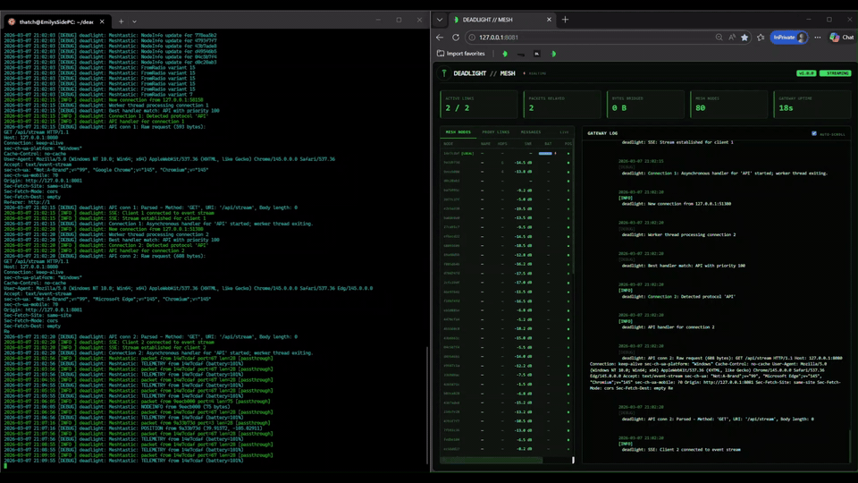

# deadmesh

**Internet-over-LoRa: Update your blog from a can on a string from the smoldering rubble.**

Part of the [Deadlight ecosystem](https://github.com/gnarzilla#deadlight-ecosystem) secure, performant, privacy-focused tools for resilient connectivity on mesh/satellite/spotty networks.

 · [Project Blog](https://meshtastic.deadlight.boo) · [Why This Exists](#why-this-exists) · [Getting Started](#getting-started) · [Hardware](#hardware) · [Dashboard](#dashboard) · [Usage](#usage) · [Configuration](#configuration) · [How It Works](#how-it-works) · [Real-World Use Cases](#real-world-use-cases) · [Performance](#performance) · [Roadmap](#roadmap) · [License](#license)


## Overview

**deadmesh** transforms LoRa mesh networks into practical Internet gateways. Built on the [proxy.deadlight](https://github.com/gnarzilla/proxy.deadlight) foundation, it adds transparent mesh networking that lets any device on a Meshtastic mesh access standard Internet protocols HTTP/HTTPS, email, DNS, FTP, as if they had normal connectivity.

**What makes this different from other mesh solutions:**
- Standard protocols work unchanged: browse websites, send email, use apps
- Transparent to applications, no special client software needed
- Automatic fragmentation and reassembly for mesh transport
- Full MITM proxy capabilities for traffic inspection and caching
- Works with existing Meshtastic hardware and networks
- Truly off-grid: solar-powered nodes can provide connectivity across kilometers
- Real-time gateway dashboard with SSE streaming, embedded in the binary
- Live mesh visibility: see every node, position, telemetry, and text message on your network

Think of it as giving your Meshtastic network the capabilities of a satellite terminal, running on $30 hardware with zero monthly fees.

## Why This Exists

Meshtastic networks are incredible for messaging and telemetry, but they weren't designed for general Internet access. Each protocol (HTTP, SMTP, DNS) would need custom mesh-aware implementations, a chicken-and-egg problem where applications won't add mesh support without users, and users won't adopt mesh without applications.

deadmesh sits in the middle:
1. **Mesh side**: Speaks fluent Meshtastic (protobuf over LoRa serial with proper API handshake)
2. **Internet side**: Speaks every protocol your applications already use
3. **Bridges transparently**: Fragments outgoing requests, reassembles incoming responses

**Result**: Your mesh network works with everything: email clients, web browsers, update tools, API services, without modifying a single line of application code.


### Critical Scenarios This Enables

- **Disaster Response**: Coordinate rescue operations when cell towers are down
- **Rural Connectivity**: Share one satellite uplink across dozens of kilometers
- **Censorship Resistance**: Maintain communication during Internet blackouts
- **Off-Grid Networks**: Festival/protest/research networks that disappear when powered off
- **Development Projects**: Bring Internet services to areas with zero infrastructure

## Features

- **Universal Protocol Support**: HTTP/HTTPS, SMTP/IMAP, SOCKS4/5, WebSocket, FTP. If it runs over TCP/IP, it works
- **Transparent TLS Interception**: Inspect and cache HTTPS traffic with HTTP/1.1 ALPN negotiation to minimize mesh bandwidth
- **Intelligent Fragmentation**: Automatically chunks large requests/responses into ~220-byte Meshtastic packets
- **Serial API Handshake**: Proper `want_config` initialization, auto-discovers node ID, receives full mesh state on startup
- **Live Mesh Visibility**: Decodes all Meshtastic packet types (text messages, positions, telemetry, node info, routing)
- **Store-and-Forward**: Delay-tolerant networking handles intermittent mesh connectivity
- **Connection Pooling**: Reuses upstream connections aggressively with TLS session reuse to reduce LoRa airtime cost
- **Plugin Extensibility**: Ad blocking, rate limiting, compression, caching, custom protocol handlers
- **Hardware Flexibility**: USB serial, Bluetooth, or TCP-connected radios
- **Auto-Detection**: Auto-discovers Meshtastic devices on serial ports and auto-detects local node ID from device
- **Embedded Dashboard**: Real-time gateway monitor with SSE streaming, self-contained in the binary, no external assets
- **Live Node Table**: Persistent mesh node database; names, hops, SNR, battery, position, last heard, updated from every packet type



## Getting Started

### Prerequisites

**Software**:
- Linux (Raspberry Pi, x86 server, or similar)
- GLib 2.0+, OpenSSL 1.1+, json-glib-1.0
- GCC or Clang
- Python 3 + pip (for nanopb protobuf generation during build)

**Optional** (for Meshtastic CLI testing):
- Python meshtastic package (`pip install meshtastic`)

**Hardware** (see [Hardware](#hardware) for details):
- Meshtastic-compatible LoRa radio (ESP32-based recommended)
- Gateway node: Raspberry Pi or similar with Internet connection
- Client nodes: any Meshtastic device (phone, handheld, custom)

### Quick Install

1. **Install system dependencies**:
   ```bash
   # Debian/Ubuntu/Raspberry Pi OS
   sudo apt-get install build-essential pkg-config libglib2.0-dev \
     libssl-dev libjson-glib-dev libmicrohttpd-dev protobuf-compiler xxd
   ```

   Verify they're all found:
   ```bash
   pkg-config --modversion glib-2.0 openssl json-glib-1.0
   # Should print three version numbers — if any fail, the build will fail
   ```

2. **Set up Python environment for protobuf generation**:

   The nanopb generator that compiles Meshtastic protobufs requires specific Python packages. Use a venv to avoid conflicts with system Python:
   ```bash
   python3 -m venv venv
   source venv/bin/activate
   pip install protobuf grpcio-tools
   ```
   > **Keep this venv active for the build step.** You can deactivate it after `make` completes.

3. **Clone and build**:
   ```bash
   git clone https://github.com/gnarzilla/deadmesh.git
   cd deadmesh
   make clean && make UI=1
   deactivate  # exit venv after build
   ```

   A successful build produces:
   ```
   bin/deadmesh
   bin/plugins/adblocker.so
   bin/plugins/meshtastic.so
   bin/plugins/ratelimiter.so
   tools/mesh-sim
   ```

4. **Connect your Meshtastic radio**:
   ```bash
   # Most devices appear as /dev/ttyACM0 or /dev/ttyUSB0
   ls -l /dev/ttyACM0 /dev/ttyUSB0 2>/dev/null

   # Add yourself to the dialout group
   sudo usermod -a -G dialout $USER
   # Log out and back in for group change to take effect
   ```

5. **Generate CA certificate** (for HTTPS interception):

   Create the cert directory first, then generate a local CA:
   ```bash
   mkdir -p ~/.deadlight

   openssl genrsa -out ~/.deadlight/ca.key 4096
   openssl req -new -x509 -days 3650 \
     -key ~/.deadlight/ca.key \
     -out ~/.deadlight/ca.crt \
     -subj "/CN=deadmesh CA/O=deadlight/C=US"

   chmod 600 ~/.deadlight/ca.key
   chmod 644 ~/.deadlight/ca.crt
   ```

   Install it system-wide so curl and other tools trust it:
   ```bash
   sudo cp ~/.deadlight/ca.crt /usr/local/share/ca-certificates/deadmesh.crt
   sudo update-ca-certificates
   ```

   > **Copying from another machine?** If you already have a CA from a previous install (e.g. WSL), copy both `ca.crt` and `ca.key` to `~/.deadlight/` on the new machine instead of generating new ones.

6. **Configure** — create `deadmesh.conf`:
   ```ini
   [core]
   port = 8080
   max_connections = 50
   log_level = info

   [meshtastic]
   enabled = true
   serial_port = /dev/ttyACM0
   baud_rate = 115200
   mesh_node_id = 0          ; 0 = auto-detect from device
   fragment_size = 220
   ack_timeout = 30000
   max_retries = 3
   hop_limit = 3

   [ssl]
   enabled = true
   ca_cert_file = /home/youruser/.deadlight/ca.crt
   ca_key_file = /home/youruser/.deadlight/ca.key

   [network]
   connection_pool_size = 5
   connection_pool_timeout = 600
   upstream_timeout = 120
   ```

   > **Important**: Use absolute paths for `ca_cert_file` and `ca_key_file` — replace `youruser` with your actual username. The `~` shortcut expands to `/root/` when running with `sudo`, which is not where your certs are.

7. **Run the gateway**:
   ```bash
   ./bin/deadmesh -c deadmesh.conf -v
   ```

   You should see:
   - `Configuration loaded` and `Config applied` — config is valid
   - `Meshtastic: sent want_config handshake` — serial API initialized
   - `Meshtastic: auto-detected local node ID: XXXXXXXX` — device recognized
   - `Meshtastic: NodeInfo update for XXXXXXXX` — mesh nodes populating
   - Live packet stream: `POSITION`, `TELEMETRY`, `TEXT`, `NODEINFO` from mesh

   If you see `Configuration validation failed: Cannot read CA cert file` — the path in your config doesn't match where you put the certs. Double-check the absolute path and that `~/.deadlight/ca.crt` exists.

8. **Open the dashboard** at `http://localhost:8081` to monitor gateway activity.

9. **Test the proxy**:
   ```bash
   # HTTP
   curl -x http://localhost:8080 http://example.com

   # HTTPS
   curl --cacert ~/.deadlight/ca.crt -x http://localhost:8080 https://example.com

   # SOCKS5
   curl --socks5 localhost:8080 http://example.com
   ```


### WSL (Windows Subsystem for Linux)

deadmesh works under WSL2 with USB/IP passthrough for the Meshtastic radio:

```powershell
# PowerShell (Admin) — install and attach USB device
winget install usbipd
usbipd list                              # Find your radio's BUSID
usbipd bind --busid <BUSID>             # One-time bind
usbipd attach --wsl --busid <BUSID>     # Attach to WSL (repeat after replug)
```

```bash
# WSL — verify device
ls -l /dev/ttyACM0
sudo usermod -a -G dialout $USER
```

> **Note**: You must re-run `usbipd attach` from PowerShell each time the radio is unplugged, the PC sleeps, or WSL restarts.

## Hardware

### Tested Hardware

| Device | Chip | Connection | Status |
|---|---|---|---|
| **Seeed Wio Tracker L1** | nRF52840 + SX1262 | USB CDC (`/dev/ttyACM0`) | ✅ Verified |
| RAK WisBlock (RAK4631) | nRF52840 + SX1262 | USB CDC | Expected to work |
| Heltec LoRa 32 V3 | ESP32-S3 + SX1262 | USB CDC (CH9102) | Expected to work |
| Heltec V4 | ESP32-S3 | USB CDC | Expected to work |
| Lilygo T-Beam | ESP32 + SX1276/8 | USB UART (CP2104) | Expected to work |
| Lilygo T-Echo | nRF52840 + SX1262 | USB CDC | Expected to work |
| Station G2 | ESP32-S3 | USB CDC | Expected to work |

### Recommended Gateway Setup

**Option 1: Raspberry Pi Gateway** (most versatile)
- Raspberry Pi 4/5 (2GB+ RAM)
- Any Meshtastic radio from table above
- Connection: USB serial
- Power: 5V/3A supply or 12V solar panel + battery

**Option 2: x86/ARM Server** (development / high-throughput)
- Any Linux box with USB port
- Works under WSL2 with USB/IP passthrough
- Meshtastic radio via USB

**Option 3: Industrial/Outdoor**
- Weatherproof enclosure with Raspberry Pi
- High-gain directional antenna (5-8 dBi)
- Solar panel + LiFePO4 battery for 24/7 operation

### Client Devices

Any Meshtastic-compatible device works:
- **Android/iOS**: Meshtastic app on phone (Bluetooth to radio)
- **Handheld**: RAK WisBlock, Lilygo T-Echo, Heltec LoRa 32
- **Custom**: ESP32 + LoRa module + deadmesh client build

### Radio Configuration

For best Internet gateway performance:
```bash
# In Meshtastic app or CLI
meshtastic --set lora.region US --set lora.modem_preset LONG_FAST
meshtastic --set lora.tx_power 30  # Check local regulations
meshtastic --set lora.hop_limit 3  # Adjust for network size
```

## Dashboard

deadmesh ships with a real-time gateway dashboard embedded directly in the binary. No external files, no dependencies, nothing to serve separately.

**Access**: `http://localhost:8081` (configurable via `plugin.stats.web_port`)

**Features**:
- Live stats: active links, packets relayed, bytes bridged, mesh node count, gateway uptime
- Live mesh node table: node ID, name, hops, SNR, battery level, GPS position indicator, last heard age (ticks in real time)
- Gateway log stream via SSE (Server-Sent Events) zero polling
- Tabbed left panel: Mesh Nodes (default) and Proxy Links
- Green RF terminal aesthetic with antenna favicon in browser tab

Build with dashboard support:
```bash
make clean && make UI=1
```

## Usage

### Basic Configuration

Create `deadmesh.conf`:

```ini
[core]
port = 8080
max_connections = 50
log_level = info

[meshtastic]
enabled = true
serial_port = /dev/ttyACM0
baud_rate = 115200
mesh_node_id = 0             ; 0 = auto-detect from device on startup
custom_port = 100            ; Meshtastic portnum for deadmesh traffic
fragment_size = 220          ; max payload bytes per LoRa packet
ack_timeout = 30000          ; ms — 30s for mesh ACKs
max_retries = 3
hop_limit = 3

[ssl]
enabled = true
ca_cert_file = /home/youruser/.deadlight/ca.crt
ca_key_file = /home/youruser/.deadlight/ca.key

[network]
connection_pool_size = 5
connection_pool_timeout = 600
upstream_timeout = 120
```

> **Important**: Use absolute paths for cert files. Running with `sudo` changes `~` to `/root/`.

### Client Setup

**On mesh client devices**, configure proxy settings:

```bash
# Linux/Mac
export http_proxy=http://gateway-ip:8080
export https_proxy=http://gateway-ip:8080

# Or point any application at:
# HTTP Proxy: gateway-ip  port 8080
# SOCKS5:     gateway-ip  port 8080
```

**On Android** (Meshtastic app + ProxyDroid):
1. Install ProxyDroid
2. Set proxy host to gateway IP, port 8080
3. Connect Meshtastic app via Bluetooth to your radio

### Testing

```bash
# HTTP through gateway
curl -x http://localhost:8080 http://example.com

# HTTPS (with CA cert — use absolute path)
curl --cacert /home/youruser/.deadlight/ca.crt -x http://localhost:8080 https://example.com

# SOCKS5
curl --socks5 localhost:8080 http://example.com

# SOCKS4
curl --socks4 localhost:8080 http://example.com

# Send email via mesh relay
curl -x http://localhost:8080 \
  --mail-from sender@example.com \
  --mail-rcpt recipient@example.com \
  --upload-file message.txt \
  smtp://smtp.gmail.com:587

# SSH over mesh (SOCKS5 proxy)
ssh -o ProxyCommand="nc -X 5 -x localhost:8080 %h %p" user@remote-server
```

### Testing with One Device

You don't need a second radio to test the proxy and fragmentation logic. The mesh simulator generates synthetic mesh sessions:

```bash
# Run the gateway in one terminal
./bin/deadmesh -c deadmesh.conf -v

# In another terminal, drive a simulated mesh client session
./tools/mesh-sim --gateway localhost:8080 --target http://example.com
```

This exercises the full reassembly and session routing path without any LoRa hardware. To test actual over-the-air proxy sessions you need a second Meshtastic device configured as a client.

### Meshtastic CLI (optional, for testing)

```bash
pip install meshtastic
meshtastic --info --port /dev/ttyACM0
```

> **Note**: Stop deadmesh before using the Meshtastic CLI — they cannot share the serial port simultaneously.

## Configuration

### Full Reference

**`[core]`** — port, bind address, max connections, log level, worker threads

**`[meshtastic]`** — serial port, baud rate, node ID (0=auto-detect), custom portnum, fragment size, ACK timeout, retries, hop limit, gateway announcement

**`[ssl]`** — CA cert/key paths (use absolute paths), cipher suites, certificate cache

**`[network]`** — connection pool size/timeout, upstream timeout, DNS, keepalive

**`[vpn]`** — optional TUN/TAP gateway for routing entire device traffic through mesh

**`[plugins]`** — enable/disable individual plugins, plugin directory, autoload list

**`[plugin.compressor]`** — compression algorithms, minimum size threshold (strongly recommended over LoRa)

**`[plugin.cache]`** — cache directory, max size, TTL (reduces repeat mesh traffic significantly)

**`[plugin.ratelimiter]`** — priority queuing and rate limiting

**`[plugin.stats]`** — dashboard port, update interval, history size

### Optimizing for Mesh Performance

**Bandwidth conservation**:
```ini
[plugin.compressor]
enabled = true
min_size = 512
algorithms = gzip,brotli

[plugin.cache]
enabled = true
max_size_mb = 500
ttl_hours = 24
```

**Latency tolerance** (multi-hop paths):
```ini
[meshtastic]
ack_timeout = 60000
max_retries = 5

[network]
upstream_timeout = 300
connection_pool_timeout = 600
```

### Multi-Gateway Setup

For redundancy across a large mesh:
```ini
[meshtastic]
gateway_mode = true
announce_interval = 300
```

Multiple deadmesh gateways on the same channel will announce themselves, allowing clients to route via the nearest available gateway.

## How It Works

### Architecture Overview

```
┌─────────────┐                  ┌──────────────┐                ┌──────────┐
│ Mesh Client │  LoRa Packets    │   deadmesh   │  TCP/IP        │ Internet │
│  (Phone /   ├─────────────────>│   Gateway    ├───────────────>│ Services │
│  Handheld)  │  (868/915 MHz)   │              │                │          │
│             │                  │ - Fragment   │                │  HTTP    │
│ Meshtastic  │                  │ - Reassemble │                │  SMTP    │
│    App      │<─────────────────┤ - TLS Proxy  │<───────────────┤  IMAP    │
└─────────────┘                  │ - Cache      │                └──────────┘
                                 │ - Compress   │
                                 └──────┬───────┘
                                        │
                                 ┌──────┴───────┐
                                 │  Serial API   │
                                 │  0x94 0xC3    │
                                 │  protobuf     │
                                 │  want_config  │
                                 └──────┬───────┘
                                        │ USB
                                 ┌──────┴───────┐
                                 │  Meshtastic   │
                                 │  Radio        │
                                 │  (LoRa)       │
                                 └──────────────┘
```

### Startup Sequence

```
1. Open serial port (/dev/ttyACM0) at 115200 baud
2. Send want_config handshake (ToRadio protobuf)thatch@uPi:~/Dev/deadmesh$ cat .gitmodules 2>/dev/null || echo "no .gitmodules found"
no .gitmodules found
thatch@uPi:~/Dev/deadmesh$ git submodule status
thatch@uPi:~/Dev/deadmesh$ ls src/plugins/nanopb/ 2>/dev/null || echo "nanopb missing"
AUTHORS.txt      MODULE.bazel       build.py       generator          pb_common.h       spm-test
BUILD.bazel      MODULE.bazel.lock  conan-wrapper  library.json       pb_decode.c       spm_headers
CHANGELOG.txt    Package.swift      conanfile.py   meson.build        pb_decode.h       spm_resources
CMakeLists.txt   README.md          docs           meson_options.txt  pb_encode.c       tests
CONTRIBUTING.md  WORKSPACE          examples       pb.h               pb_encode.h       tools
LICENSE.txt      build-tests        extra          pb_common.c        requirements.txt  zephyr
thatch@uPi:~/Dev/deadmesh$ ls src/plugins/protobufs// 2>/dev/null || echo "protoc missing"
protoc missing
thatch@uPi:~/Dev/deadmesh$ git fetch
remote: Enumerating objects: 83, done.
remote: Counting objects: 100% (83/83), done.
remote: Compressing objects: 100% (64/64), done.
remote: Total 79 (delta 6), reused 79 (delta 6), pack-reused 0 (from 0)
Unpacking objects: 100% (79/79), 89.90 KiB | 309.00 KiB/s, done.
From github.com:gnarzilla/deadmesh
   e709090..6aec481  main       -> origin/main
thatch@uPi:~/Dev/deadmesh$ git merge
Updating e709090..6aec481
Fast-forward
 .gitignore                                                 |    3 -
 src/plugins/protobufs/.gitattributes                       |    3 +
 src/plugins/protobufs/.github/pull_request_template.md     |   30 +
 src/plugins/protobufs/.github/workflows/ci.yml             |   24 +
 src/plugins/protobufs/.github/workflows/create_tag.yml     |   71 ++
 src/plugins/protobufs/.github/workflows/publish.yml        |  132 +++
 src/plugins/protobufs/.github/workflows/pull_request.yml   |   23 +
 src/plugins/protobufs/.gitignore                           |    1 +
 src/plugins/protobufs/.vscode/extensions.json              |    3 +
 src/plugins/protobufs/.vscode/settings.json                |    4 +
 src/plugins/protobufs/LICENSE                              |  674 ++++++++++++
 src/plugins/protobufs/README.md                            |   16 +
 src/plugins/protobufs/buf.gen.yaml                         |   10 +
 src/plugins/protobufs/buf.yaml                             |   19 +
 src/plugins/protobufs/meshtastic/admin.options             |   19 +
 src/plugins/protobufs/meshtastic/admin.proto               |  583 +++++++++++
 src/plugins/protobufs/meshtastic/apponly.options           |    1 +
 src/plugins/protobufs/meshtastic/apponly.proto             |   31 +
 src/plugins/protobufs/meshtastic/atak.options              |    8 +
 src/plugins/protobufs/meshtastic/atak.proto                |  263 +++++
 src/plugins/protobufs/meshtastic/cannedmessages.options    |    1 +
 src/plugins/protobufs/meshtastic/cannedmessages.proto      |   19 +
 src/plugins/protobufs/meshtastic/channel.options           |    5 +
 src/plugins/protobufs/meshtastic/channel.proto             |  156 +++
 src/plugins/protobufs/meshtastic/clientonly.options        |    4 +
 src/plugins/protobufs/meshtastic/clientonly.proto          |   58 ++
 src/plugins/protobufs/meshtastic/config.options            |   24 +
 src/plugins/protobufs/meshtastic/config.proto              | 1200 +++++++++++++++++++++
 src/plugins/protobufs/meshtastic/connection_status.options |    1 +
 src/plugins/protobufs/meshtastic/connection_status.proto   |  120 +++
 src/plugins/protobufs/meshtastic/device_ui.options         |   12 +
 src/plugins/protobufs/meshtastic/device_ui.proto           |  389 +++++++
 src/plugins/protobufs/meshtastic/deviceonly.options        |   18 +
 src/plugins/protobufs/meshtastic/deviceonly.proto          |  301 ++++++
 src/plugins/protobufs/meshtastic/interdevice.options       |    1 +
 src/plugins/protobufs/meshtastic/interdevice.proto         |   44 +
 src/plugins/protobufs/meshtastic/localonly.proto           |  140 +++
 src/plugins/protobufs/meshtastic/mesh.options              |   92 ++
 src/plugins/protobufs/meshtastic/mesh.proto                | 2424 +++++++++++++++++++++++++++++++++++++++++++
 src/plugins/protobufs/meshtastic/module_config.options     |   29 +
 src/plugins/protobufs/meshtastic/module_config.proto       |  870 ++++++++++++++++
 src/plugins/protobufs/meshtastic/mqtt.options              |    8 +
 src/plugins/protobufs/meshtastic/mqtt.proto                |  112 ++
 src/plugins/protobufs/meshtastic/paxcount.proto            |   29 +
 src/plugins/protobufs/meshtastic/portnums.proto            |  244 +++++
 src/plugins/protobufs/meshtastic/powermon.proto            |  103 ++
 src/plugins/protobufs/meshtastic/remote_hardware.proto     |   75 ++
 src/plugins/protobufs/meshtastic/rtttl.options             |    1 +
 src/plugins/protobufs/meshtastic/rtttl.proto               |   19 +
 src/plugins/protobufs/meshtastic/storeforward.options      |    1 +
 src/plugins/protobufs/meshtastic/storeforward.proto        |  218 ++++
 src/plugins/protobufs/meshtastic/telemetry.options         |   18 +
 src/plugins/protobufs/meshtastic/telemetry.proto           |  813 +++++++++++++++
 src/plugins/protobufs/meshtastic/xmodem.options            |    6 +
 src/plugins/protobufs/meshtastic/xmodem.proto              |   27 +
 src/plugins/protobufs/nanopb.proto                         |  185 ++++
 src/plugins/protobufs/packages/rust/Cargo.lock             |  105 ++
 src/plugins/protobufs/packages/rust/Cargo.toml             |   15 +
 src/plugins/protobufs/packages/rust/src/generated/.gitkeep |    0
 src/plugins/protobufs/packages/rust/src/lib.rs             |    5 +
 src/plugins/protobufs/packages/ts/deno.json                |   15 +
 src/plugins/protobufs/packages/ts/deno.lock                |   16 +
 src/plugins/protobufs/packages/ts/lib/.gitkeep             |    0
 src/plugins/protobufs/packages/ts/mod.ts                   |   20 +
 src/plugins/protobufs/packages/ts/package.json             |   32 +
 src/plugins/protobufs/renovate.json                        |    6 +
 66 files changed, 9896 insertions(+), 3 deletions(-)
 create mode 100644 src/plugins/protobufs/.gitattributes
 create mode 100644 src/plugins/protobufs/.github/pull_request_template.md
 create mode 100644 src/plugins/protobufs/.github/workflows/ci.yml
 create mode 100644 src/plugins/protobufs/.github/workflows/create_tag.yml
 create mode 100644 src/plugins/protobufs/.github/workflows/publish.yml
 create mode 100644 src/plugins/protobufs/.github/workflows/pull_request.yml
 create mode 100644 src/plugins/protobufs/.gitignore
 create mode 100644 src/plugins/protobufs/.vscode/extensions.json
 create mode 100644 src/plugins/protobufs/.vscode/settings.json
 create mode 100644 src/plugins/protobufs/LICENSE
 create mode 100644 src/plugins/protobufs/README.md
 create mode 100644 src/plugins/protobufs/buf.gen.yaml
 create mode 100644 src/plugins/protobufs/buf.yaml
 create mode 100644 src/plugins/protobufs/meshtastic/admin.options
 create mode 100644 src/plugins/protobufs/meshtastic/admin.proto
 create mode 100644 src/plugins/protobufs/meshtastic/apponly.options
 create mode 100644 src/plugins/protobufs/meshtastic/apponly.proto
 create mode 100644 src/plugins/protobufs/meshtastic/atak.options
 create mode 100644 src/plugins/protobufs/meshtastic/atak.proto
 create mode 100644 src/plugins/protobufs/meshtastic/cannedmessages.options
 create mode 100644 src/plugins/protobufs/meshtastic/cannedmessages.proto
 create mode 100644 src/plugins/protobufs/meshtastic/channel.options
 create mode 100644 src/plugins/protobufs/meshtastic/channel.proto
 create mode 100644 src/plugins/protobufs/meshtastic/clientonly.options
 create mode 100644 src/plugins/protobufs/meshtastic/clientonly.proto
 create mode 100644 src/plugins/protobufs/meshtastic/config.options
 create mode 100644 src/plugins/protobufs/meshtastic/config.proto
 create mode 100644 src/plugins/protobufs/meshtastic/connection_status.options
 create mode 100644 src/plugins/protobufs/meshtastic/connection_status.proto
 create mode 100644 src/plugins/protobufs/meshtastic/device_ui.options
 create mode 100644 src/plugins/protobufs/meshtastic/device_ui.proto
 create mode 100644 src/plugins/protobufs/meshtastic/deviceonly.options
 create mode 100644 src/plugins/protobufs/meshtastic/deviceonly.proto
 create mode 100644 src/plugins/protobufs/meshtastic/interdevice.options
 create mode 100644 src/plugins/protobufs/meshtastic/interdevice.proto
 create mode 100644 src/plugins/protobufs/meshtastic/localonly.proto
 create mode 100644 src/plugins/protobufs/meshtastic/mesh.options
 create mode 100644 src/plugins/protobufs/meshtastic/mesh.proto
 create mode 100644 src/plugins/protobufs/meshtastic/module_config.options
 create mode 100644 src/plugins/protobufs/meshtastic/module_config.proto
 create mode 100644 src/plugins/protobufs/meshtastic/mqtt.options
 create mode 100644 src/plugins/protobufs/meshtastic/mqtt.proto
 create mode 100644 src/plugins/protobufs/meshtastic/paxcount.proto
 create mode 100644 src/plugins/protobufs/meshtastic/portnums.proto
 create mode 100644 src/plugins/protobufs/meshtastic/powermon.proto
 create mode 100644 src/plugins/protobufs/meshtastic/remote_hardware.proto
 create mode 100644 src/plugins/protobufs/meshtastic/rtttl.options
 create mode 100644 src/plugins/protobufs/meshtastic/rtttl.proto
 create mode 100644 src/plugins/protobufs/meshtastic/storeforward.options
 create mode 100644 src/plugins/protobufs/meshtastic/storeforward.proto
 create mode 100644 src/plugins/protobufs/meshtastic/telemetry.options
 create mode 100644 src/plugins/protobufs/meshtastic/telemetry.proto
 create mode 100644 src/plugins/protobufs/meshtastic/xmodem.options
 create mode 100644 src/plugins/protobufs/meshtastic/xmodem.proto
 create mode 100644 src/plugins/protobufs/nanopb.proto
 create mode 100644 src/plugins/protobufs/packages/rust/Cargo.lock
 create mode 100644 src/plugins/protobufs/packages/rust/Cargo.toml
 create mode 100644 src/plugins/protobufs/packages/rust/src/generated/.gitkeep
 create mode 100644 src/plugins/protobufs/packages/rust/src/lib.rs
 create mode 100644 src/plugins/protobufs/packages/ts/deno.json
 create mode 100644 src/plugins/protobufs/packages/ts/deno.lock
 create mode 100644 src/plugins/protobufs/packages/ts/lib/.gitkeep
 create mode 100644 src/plugins/protobufs/packages/ts/mod.ts
 create mode 100755 src/plugins/protobufs/packages/ts/package.json
 create mode 100644 src/plugins/protobufs/renovate.json
thatch@uPi:~/Dev/deadmesh$ make clean && make UI=1
Cleaning build files...
Clean complete
Compiling src/core/main.c...
Compiling src/core/config.c...
Compiling src/core/context.c...
Compiling src/core/logging.c...
Compiling src/core/network.c...
Compiling src/core/ssl.c...
Compiling src/core/protocols.c...
Compiling src/core/protocol_detection.c...
Compiling src/core/plugins.c...
Compiling src/core/request.c...
Compiling src/core/utils.c...
Compiling src/core/ssl_tunnel.c...
Compiling src/core/connection_pool.c...
Compiling src/protocols/http.c...
Compiling src/protocols/imap.c...
Compiling src/protocols/imaps.c...
Compiling src/protocols/socks.c...
Compiling src/protocols/smtp.c...
Compiling src/protocols/websocket.c...
Compiling src/protocols/ftp.c...
Compiling src/protocols/api.c...
Compiling src/plugins/ratelimiter.c...
Compiling src/mesh/mesh_framing.c...
Compiling src/mesh/mesh_session.c...
Compiling src/mesh/mesh_stream.c...
Compiling src/vpn/vpn_gateway.c...
Compiling src/ui/ui.c...
Generating UI assets...
Embedding src/ui/index.html...
Embedding src/ui/favicon.ico...
Embedding src/ui/favicon.png...
Compiling src/ui/assets.c...
Linking deadmesh...
Built deadmesh v1.0.0
Building AdBlocker plugin...
Building RateLimiter plugin (Shared)...
Generating nanopb files from src/plugins/protobufs/meshtastic/admin.proto ...

         **********************************************************************
         *** Could not import the Google protobuf Python libraries          ***
         ***                                                                ***
         *** Easiest solution is often to install the dependencies via pip: ***
         ***    pip install protobuf grpcio-tools                           ***
         **********************************************************************
    
Traceback (most recent call last):
  File "/home/thatch/Dev/deadmesh/src/plugins/nanopb/generator/protoc-gen-nanopb", line 7, in <module>
    from nanopb_generator import *
  File "/home/thatch/Dev/deadmesh/src/plugins/nanopb/generator/nanopb_generator.py", line 28, in <module>
    import google.protobuf.text_format as text_format
ModuleNotFoundError: No module named 'google'
--nanopb_out: protoc-gen-nanopb: Plugin failed with status code 1.
make: *** [Makefile:177: src/plugins/meshtastic/meshtastic/admin.pb.c] Error 1
thatch@uPi:~/Dev/deadmesh$ python3 -m venv venv
thatch@uPi:~/Dev/deadmesh$ source venv/bin/activate
(venv) thatch@uPi:~/Dev/deadmesh$ pip install protobuf grpcio-tools
Collecting protobuf
  Using cached protobuf-7.34.0-cp310-abi3-manylinux2014_aarch64.whl.metadata (595 bytes)
Collecting grpcio-tools
  Using cached grpcio_tools-1.78.0-cp313-cp313-manylinux2014_aarch64.manylinux_2_17_aarch64.whl.metadata (5.3 kB)
Collecting protobuf
  Using cached protobuf-6.33.5-cp39-abi3-manylinux2014_aarch64.whl.metadata (593 bytes)
Collecting grpcio>=1.78.0 (from grpcio-tools)
  Using cached grpcio-1.78.0-cp313-cp313-manylinux2014_aarch64.manylinux_2_17_aarch64.whl.metadata (3.8 kB)
Collecting setuptools>=77.0.1 (from grpcio-tools)
  Using cached setuptools-82.0.0-py3-none-any.whl.metadata (6.6 kB)
Collecting typing-extensions~=4.12 (from grpcio>=1.78.0->grpcio-tools)
  Using cached typing_extensions-4.15.0-py3-none-any.whl.metadata (3.3 kB)
Using cached grpcio_tools-1.78.0-cp313-cp313-manylinux2014_aarch64.manylinux_2_17_aarch64.whl (2.6 MB)
Using cached protobuf-6.33.5-cp39-abi3-manylinux2014_aarch64.whl (324 kB)
Using cached grpcio-1.78.0-cp313-cp313-manylinux2014_aarch64.manylinux_2_17_aarch64.whl (6.5 MB)
Using cached typing_extensions-4.15.0-py3-none-any.whl (44 kB)
Using cached setuptools-82.0.0-py3-none-any.whl (1.0 MB)
Installing collected packages: typing-extensions, setuptools, protobuf, grpcio, grpcio-tools
Successfully installed grpcio-1.78.0 grpcio-tools-1.78.0 protobuf-6.33.5 setuptools-82.0.0 typing-extensions-4.15.0
(venv) thatch@uPi:~/Dev/deadmesh$ make clean && make UI=1
Cleaning build files...
Clean complete
Compiling src/core/main.c...
Compiling src/core/config.c...
Compiling src/core/context.c...
Compiling src/core/logging.c...
Compiling src/core/network.c...
Compiling src/core/ssl.c...
Compiling src/core/protocols.c...
Compiling src/core/protocol_detection.c...
Compiling src/core/plugins.c...
Compiling src/core/request.c...
Compiling src/core/utils.c...
Compiling src/core/ssl_tunnel.c...
Compiling src/core/connection_pool.c...
Compiling src/protocols/http.c...
Compiling src/protocols/imap.c...
Compiling src/protocols/imaps.c...
Compiling src/protocols/socks.c...
Compiling src/protocols/smtp.c...
Compiling src/protocols/websocket.c...
Compiling src/protocols/ftp.c...
Compiling src/protocols/api.c...
Compiling src/plugins/ratelimiter.c...
Compiling src/mesh/mesh_framing.c...
Compiling src/mesh/mesh_session.c...
Compiling src/mesh/mesh_stream.c...
Compiling src/vpn/vpn_gateway.c...
Compiling src/ui/ui.c...
Generating UI assets...
Embedding src/ui/index.html...
Embedding src/ui/favicon.ico...
Embedding src/ui/favicon.png...
Compiling src/ui/assets.c...
Linking deadmesh...
Built deadmesh v1.0.0
Building AdBlocker plugin...
Building RateLimiter plugin (Shared)...
Generating nanopb files from src/plugins/protobufs/meshtastic/admin.proto ...
Generating nanopb files from src/plugins/protobufs/meshtastic/apponly.proto ...
Generating nanopb files from src/plugins/protobufs/meshtastic/atak.proto ...
Generating nanopb files from src/plugins/protobufs/meshtastic/cannedmessages.proto ...
Generating nanopb files from src/plugins/protobufs/meshtastic/channel.proto ...
Generating nanopb files from src/plugins/protobufs/meshtastic/clientonly.proto ...
Generating nanopb files from src/plugins/protobufs/meshtastic/config.proto ...
Generating nanopb files from src/plugins/protobufs/meshtastic/connection_status.proto ...
Generating nanopb files from src/plugins/protobufs/meshtastic/device_ui.proto ...
Generating nanopb files from src/plugins/protobufs/meshtastic/interdevice.proto ...
Generating nanopb files from src/plugins/protobufs/meshtastic/localonly.proto ...
Generating nanopb files from src/plugins/protobufs/meshtastic/mesh.proto ...
Generating nanopb files from src/plugins/protobufs/meshtastic/module_config.proto ...
Generating nanopb files from src/plugins/protobufs/meshtastic/mqtt.proto ...
Generating nanopb files from src/plugins/protobufs/meshtastic/paxcount.proto ...
Generating nanopb files from src/plugins/protobufs/meshtastic/portnums.proto ...
Generating nanopb files from src/plugins/protobufs/meshtastic/powermon.proto ...
Generating nanopb files from src/plugins/protobufs/meshtastic/remote_hardware.proto ...
Generating nanopb files from src/plugins/protobufs/meshtastic/rtttl.proto ...
Generating nanopb files from src/plugins/protobufs/meshtastic/storeforward.proto ...
Generating nanopb files from src/plugins/protobufs/meshtastic/telemetry.proto ...
Generating nanopb files from src/plugins/protobufs/meshtastic/xmodem.proto ...
Building MeshtasticTunnel plugin...
Building mesh simulator...
Simulator built: tools/mesh-sim
  Run: ./tools/mesh-sim [--loss N] [--delay MS]
(venv) thatch@uPi:~/Dev/deadmesh$ deactivate
thatch@uPi:~/Dev/deadmesh$ ./bin/deadmesh -c deadmesh -v
2026-03-08 09:07:13 [INFO ] deadlight: Config file monitoring enabled
2026-03-08 09:07:13 [INFO ] deadlight: Config applied: port=8080 pool=25 ssl=on mesh_frag=220
2026-03-08 09:07:13 [INFO ] deadlight: Configuration loaded from deadmesh
2026-03-08 09:07:13 [ERROR] deadlight: Configuration validation failed: Cannot read CA cert file: /home/thatch/.deadlight/ca.crt
2026-03-08 09:07:13 [INFO ] deadlight: deadmesh stopped

3. Receive MyNodeInfo → auto-detect local node ID
4. Receive device config, module config, channel config
5. Receive NodeInfo for all known mesh nodes → populate node table
6. Begin receiving live mesh packets (position, telemetry, text, etc.)
7. Filter for custom portnum (100) for proxy session traffic
8. All other packets update node table (hops, SNR, battery, position)
```

### Packet Flow

**Request (client → Internet)**:
```
HTTP GET request (1500 bytes)
└─> Split into 7 LoRa packets (~220 bytes each)
└─> Each tagged with sequence number + session ID
└─> Sent hop-by-hop through mesh to gateway on portnum 100
└─> Gateway reassembles → proxies to Internet
```

**Response (Internet → client)**:
```
HTTP response (50KB HTML)
└─> Compressed if plugin.compressor enabled (~5-10KB)
└─> Cached if cacheable (saves future airtime)
└─> Fragmented into LoRa packets with flow control
└─> Client reassembles → delivers to application
```

### Serial Framing

Meshtastic uses a length-prefixed binary protocol over serial:

```
┌────────┬────────┬───────────┬───────────┬─────────────────┐
│ 0x94   │ 0xC3   │ len_hi    │ len_lo    │ protobuf payload│
│ magic0 │ magic1 │ (MSB)     │ (LSB)     │ (FromRadio/     │
│        │        │           │           │  ToRadio)       │
└────────┴────────┴───────────┴───────────┴─────────────────┘
```

The framing layer handles sync recovery — if magic bytes are lost mid-stream, the state machine re-synchronizes automatically.

### Protocol Detection

deadmesh auto-detects protocols by inspecting initial bytes, no configuration needed:

| Initial bytes | Protocol | Handler |
|---|---|---|
| `GET / HTTP/1.1` | HTTP | Forward to upstream |
| `CONNECT host:443` | HTTPS tunnel | TLS interception (HTTP/1.1 ALPN) |
| `EHLO` / `HELO` | SMTP | Email relay |
| `A001 NOOP` | IMAP | Mail client support |
| `\x05` | SOCKS5 | Transparent tunneling |
| `\x04` | SOCKS4 | Legacy tunneling |

### Meshtastic Packet Types Decoded

| Port | Type | Handling |
|---|---|---|
| 1 | TEXT_MESSAGE | Logged for mesh visibility |
| 3 | POSITION | Node table updated (lat/lon/alt) |
| 4 | NODEINFO | Node table updated (name, position, SNR) |
| 5 | ROUTING | Logged |
| 67 | TELEMETRY | Node table updated (battery level) |
| 100 | DEADMESH (custom) | Routed to proxy session manager |

### Node Table

Every packet received updates the in-memory node table keyed by node ID. The table persists for the lifetime of the gateway process and is exposed via `/api/nodes`. Fields populated per source:

- **NodeInfo (startup dump)**: short name, long name, position, SNR, last heard timestamp
- **Any decoded packet header**: hops away (`hop_start - hop_limit`), SNR, last heard
- **POSITION_APP**: latitude, longitude, altitude
- **TELEMETRY_APP**: battery level

### Security Model

**Encryption layers**:
1. **LoRa PHY**: AES-256 at the Meshtastic layer (channel PSK)
2. **TLS**: End-to-end between client and final destination (HTTP/1.1 negotiated via ALPN)
3. **Proxy MITM** (optional): deadmesh terminates TLS for caching/inspection — requires clients to trust the gateway CA

**Trust model**: Gateway holds the root CA. Mesh uses Meshtastic channel encryption. Clients trust the gateway CA by installing `ca.crt`.

**Privacy**: Mesh node IDs are pseudonymous. For operational security in sensitive deployments, rotate node IDs and channel keys regularly, and avoid PII in mesh metadata.

## Real-World Use Cases

### Disaster Response Network

**Scenario**: Earthquake destroys cell infrastructure

**Setup**: Solar-powered deadmesh gateway at field hospital (satellite uplink). Rescue teams carry Meshtastic handhelds (10km range per hop). Coordinate via email, share maps, update databases.

**Result**: Teams stay connected across 50+ km² with zero functioning infrastructure.

### Rural Community Internet

**Scenario**: Village 30km from nearest fiber

**Setup**: One gateway at village center (WiMAX or satellite backhaul). Residents install Meshtastic radios on roofs. Multi-hop mesh covers entire valley.

**Result**: 100+ households share a single Internet connection. Hardware cost ~$50/household, no monthly fees.

### Protest / Festival Network

**Scenario**: Large gathering needs coordination without government-controlled infrastructure

**Setup**: Organizers carry deadmesh gateways with LTE failover. Attendees use Meshtastic app on phones. Network disappears forensically when powered down.

**Result**: Thousands communicate freely. No persistent logs, no fixed infrastructure to seize.

### Journalist in Blackout Zone

**Scenario**: Government shuts down Internet during protests

**Setup**: Journalist has Meshtastic radio + deadmesh on laptop. Connects to gateway run by colleague 15km away (who has connectivity). Files stories via mesh SMTP relay.

**Result**: Censorship bypassed. Reports reach editors despite blackout.

## Performance

### Throughput Expectations

**LoRa physical layer** (LONG_FAST preset):
- Raw bitrate: ~5.5 kbps
- Effective throughput: ~3-4 kbps after protocol overhead
- Latency: 500ms–5s per hop

**Real-world application performance**:
- **Email**: 10-20 messages/minute (text)
- **Web browsing**: 30-60 seconds per page (with caching)
- **DNS**: ~2 seconds per lookup (cache aggressively)
- **API calls**: 5-10 seconds per request
- **File transfer**: ~400 bytes/sec (~1.4 MB/hour)

**Optimization tips**:
- Enable compression — 3-10x improvement for text content
- Enable caching — repeat requests cost zero airtime
- Use image proxies — reduce image sizes before they hit the mesh
- Batch requests — avoid chatty protocols

### Scaling

**Single gateway**: 10-20 concurrent mesh clients comfortably. EU duty cycle regulations (1% airtime) are typically the binding constraint.

**Multi-gateway**: Horizontally scalable. Gateways announce availability; clients route via nearest. Adding gateways directly adds capacity.

**Bottlenecks in order**: LoRa duty cycle → mesh hop count (>4 hops = diminishing returns) → gateway uplink bandwidth.

## Roadmap

### v1.1 (Current)
- [x] HTTP/HTTPS/SOCKS4/SOCKS5 proxy, verified working
- [x] TLS interception with upstream certificate mimicry
- [x] Connection pooling with TLS session reuse
- [x] Serial API handshake (`want_config`) for Meshtastic 2.x firmware
- [x] Auto-detect local node ID from device
- [x] Full mesh packet decoding: text, position, telemetry, nodeinfo, routing
- [x] Embedded SSE dashboard
- [x] Plugin system: ad blocker, rate limiter, meshtastic transport
- [x] Mesh simulator for development (`tools/mesh-sim`)
- [x] WSL2 support via USB/IP passthrough
- [x] Live node table in dashboard: names, hops, SNR, battery, position, last heard
- [x] Sortable node table columns
- [x] Real-time last-heard age (client-side tick, no polling)
- [x] Tabbed dashboard panel (Mesh Nodes / Proxy Links)
- [x] `/api/nodes` endpoint: full node table as JSON
- [x] Node table persisted in `DeadlightContext` accessible to all subsystems

### v1.2 (Next)
- [ ] End-to-end proxy session test over real LoRa
- [ ] Node topology map: visualize mesh graph from hop data
- [ ] Text message panel: display mesh chat in dashboard
- [ ] SSE push for node table updates (currently polls every 5s)
- [ ] Adaptive fragmentation based on live mesh conditions
- [ ] Exponential backoff retry
- [ ] Android client app (native deadmesh on-device)

### v1.3
- [ ] Multi-gateway coordination protocol
- [ ] Offline message queue (store-and-forward when gateway unreachable)
- [ ] Per-client/protocol bandwidth shaping
- [ ] WebRTC signaling over mesh (peer-to-peer voice/video)
- [ ] Per-node RSSI, airtime, channel utilization in dashboard

### v2.0 (Future)
- [ ] Full IPv6 support
- [ ] Meshtastic firmware integration (run deadmesh directly on ESP32)
- [ ] Satellite backhaul optimization (Starlink, Iridium)
- [ ] Mesh route prediction

## Build Details

### Dependencies

```bash
# Debian/Ubuntu
sudo apt-get install build-essential pkg-config libglib2.0-dev \
  libssl-dev libjson-glib-dev

# Python (for nanopb protobuf generation)
pip install protobuf grpcio-tools
```

### Build Targets

```bash
make clean && make UI=1     # Full build with dashboard
make clean && make           # Build without dashboard
make                         # Incremental build
```

### Build Output

```
bin/deadmesh                 # Main binary
bin/plugins/adblocker.so     # Ad blocker plugin
bin/plugins/meshtastic.so    # Meshtastic transport plugin
bin/plugins/ratelimiter.so   # Rate limiter plugin
tools/mesh-sim               # Mesh network simulator
```

## Contributing

deadmesh is a specialized component of the [Deadlight ecosystem](https://deadlight.boo), built on [proxy.deadlight](https://github.com/gnarzilla/proxy.deadlight). Contributions welcome:

- **Protocol optimizations**: Improve mesh efficiency
- **Hardware testing**: Validate on different radio platforms
- **Real-world deployments**: Share use cases and lessons learned
- **Dashboard improvements**: Mesh visualization, node maps, telemetry charts
- **Documentation**: Non-English guides especially valuable for global deployments

See [CONTRIBUTING.md](docs/CONTRIBUTING.md) for guidelines.

## Support & Community

- **Issues**: [GitHub Issues](https://github.com/gnarzilla/meshtastic.deadlight/issues)
- **Discussions**: [GitHub Discussions](https://github.com/gnarzilla/meshtastic.deadlight/discussions)
- **Blog**: [meshtastic.deadlight.boo](https://meshtastic.deadlight.boo)
- **Support development**: [ko-fi/gnarzilla](https://ko-fi.com/gnarzilla)

## Deadlight Ecosystem

deadmesh is one layer of a modular stack:

| Project | Lang | Role |
|---|---|---|
| [proxy.deadlight](https://github.com/gnarzilla/proxy.deadlight) | C | SMTP/SOCKS/HTTP/VPN proxy foundation |
| **deadmesh** (this) | C | LoRa-to-Internet mesh gateway |
| [blog.deadlight](https://deadlight.boo) | JS | <10KB pages, email posting, edge-first |
| [vault.deadlight](https://github.com/gnarzilla/vault.deadlight) | C | Offline credential store, proxy integration |
| [deadlight-bootstrap](https://v1.deadlight.boo) | JS | Cloudflare Workers + D1 framework |

Each component works standalone but the stack is designed to thrive together; blog.deadlight posting over deadmesh via proxy.deadlight with vault.deadlight managing credentials, all running on solar-powered hardware in a field somewhere.

## Legal & Safety

**Radio regulations**: LoRa operates in license-free ISM bands, but transmission power and duty cycle are regulated. Check your local rules (FCC Part 15 in US, ETSI EN 300-220 in EU).

**Encryption export**: This software includes strong cryptography. Check export restrictions before deploying internationally.

**Responsible use**: This tool can bypass censorship and enable communication in emergencies. It can also be misused. Use ethically and legally. The authors are not responsible for misuse.

**Privacy**: Meshtastic mesh networks are pseudonymous, not anonymous. For operational security in high-risk environments: rotate node IDs, use ephemeral channel keys, avoid PII in mesh metadata.

## License

MIT License — see [LICENSE](LICENSE)

Includes:
- [Meshtastic Protobufs](https://github.com/meshtastic/protobufs) (GPL v3)
- [nanopb](https://jpa.kapsi.fi/nanopb/) (zlib license)

---

**Status**: v1.1 — proxy verified, mesh serial active, 95+ nodes visible, live dashboard with node table | **Maintained by**: [@gnarzilla](https://github.com/gnarzilla) | [deadlight.boo](https://deadlight.boo)
